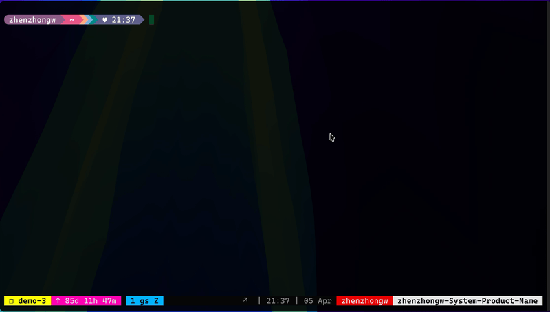
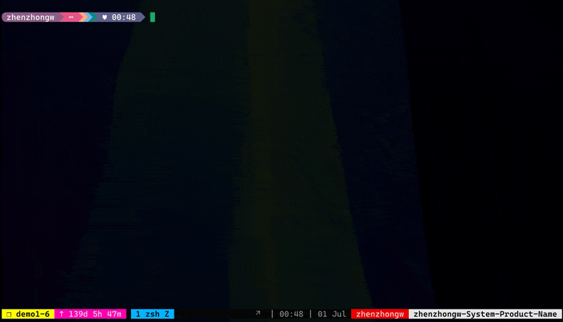

<div align="center">
  
  <h1 style="margin-top: 0.2em;">GhostScope</h1>
  <h3>⚡ Next-generation eBPF userspace runtime tracer</h3>
  <p>
    <strong>Printf debugging evolved</strong> — Real-time tracing without stopping your application.
  </p>

  <p>
    
    
    
    
  </p>

  <p>
    <a href="README-zh.md"><strong>中文文档</strong></a>
  </p>
</div>

<br />

## Overview

GhostScope is a **source-aware userspace tracer** for live Linux processes. With DWARF debug info, it lets you attach at function, source-line, or instruction granularity, print the values that matter, and emit source-aware call stacks without stopping the target.

> *"The most effective debugging tool is still careful thought, coupled with judiciously placed print statements."* — Brian Kernighan

### When To Use GhostScope

- You are diagnosing a production service that must stay online: GDB-style stop-the-world debugging would cause too much disruption, and you prefer an eBPF-based workflow with stronger safety boundaries and lower overhead than traditional kernel-module instrumentation.
- You need source-line probes that can read real locals, parameters, globals, and complex data, not just function entry arguments.
- You want DWARF-unwound stack backtraces from the same live probe that prints the relevant state.
- You need to explain how execution reached a specific source line, function, request, or code path without stopping the process.
- You want a low-friction path from "I wish I had one more printf here" to a repeatable CLI trace script.

### When Not To Use GhostScope

- Use GDB when you want an interactive debugging experience with breakpoints, single-stepping, memory writes, or coredump debugging.
- Use `perf probe` when you want a quick one-off probe at a function, source line, or local variable inside the perf ecosystem.
- Use bpftrace or SystemTap when you want broad kernel + userspace event aggregation in one script.
- Do not expect source-level variable tracing to work well without DWARF debug info for the modules you care about.

### GhostScope vs perf, GDB, bpftrace, and SystemTap

For the full, centrally maintained comparison, see the [Tool Comparison](docs/comparison.md).
You can also refer to the [FAQ](docs/faq.md).

### AI Runtime Analysis Skill

GhostScope supports two modes: an interactive TUI mode, and a CLI mode built around `--script` and `--script-file`. The latter is the more AI-optimized workflow for automation and agent-driven runtime analysis.

Install the shared skill for Codex or Claude Code:

```bash
curl -fsSL https://raw.githubusercontent.com/swananan/ghostscope/main/scripts/skills/install_ghostscope_runtime_analysis_skill.sh | bash -s -- --copy
```

If you already have the repository checked out locally, `./scripts/skills/install_ghostscope_runtime_analysis_skill.sh --copy` works too.

Use `--codex`, `--claude`, or `--all` when you want to force a target. Restart Codex or Claude Code after installation.

When the agent shares your workspace, it can often discover the source checkout path and DWARF/debug-symbol status on its own. If it cannot determine them reliably, it should ask before generating a source-backed trace. Two useful prompt patterns are: ask for the values you want to see, then ask for the call stack that explains how execution reached that point.

Context the agent can discover locally in this example:

- Source checkout: `/mnt/500g/code/openresty/openresty-1.27.1.1/build/nginx-1.27.1`
- Target binary: `/usr/local/openresty/nginx/sbin/nginx`
- Debug info: embedded DWARF is available

#### Prompt 1: Inspect live values

```text
$ghostscope-runtime-analysis trace the running nginx worker and show the raw request body bytes
```

Generated command:

```bash
WORKER_PID=$(pgrep -n -f 'nginx: worker process')
sudo ghostscope -p "$WORKER_PID" --script-file /tmp/ghostscope-nginx-body-discard.gs --script-output plain
```

Generated script:

```ghostscope
trace /mnt/500g/code/openresty/openresty-1.27.1.1/build/nginx-1.27.1/src/http/ngx_http_request_body.c:671 {
    if size > 0 {
        let req_line_len = r.request_line.len;
        let body_len = size;

        print "src=discard-preread pid={} req={:p} line={:s.req_line_len$} body_len={} body={:x.body_len$}",
            $pid, r, r.request_line.data, body_len, r.header_in.pos;
    }
}
```

Demo:



#### Prompt 2: Add call context

```text
$ghostscope-runtime-analysis trace the running nginx worker and show which request reached ngx_http_process_request, plus the source-aware call stack
```

Generated command:

```bash
WORKER_PID=$(pgrep -n -f 'nginx: worker process')
sudo ghostscope -p "$WORKER_PID" --script-file /tmp/ghostscope-nginx-request-stack.gs --script-output pretty
```

Generated script:

```ghostscope
trace ngx_http_process_request {
    let method_len = r.method_name.len;
    let uri_len = r.uri.len;
    let line_len = r.request_line.len;

    print "nginx pid={} method={:s.method_len$} uri={:s.uri_len$} line={:s.line_len$}",
        $pid, r.method_name.data, r.uri.data, r.request_line.data;

    bt full;
}
```

Here `print` answers "what request state reached this probe?", while `bt full` answers "how did nginx get here?" using DWARF-unwound, source-aware stack frames.

Demo:



For best results, make sure the relevant source tree is available, the modules you care about carry DWARF debug information, and GhostScope has the privileges needed to load eBPF programs. When that information is not discoverable locally, the skill should ask for it before generating a source-backed trace. Re-run the same installer after pulling updates; the installed skill is versioned and refreshes automatically when the version changes.

### The Printf That Should Have Been

GhostScope turns compiled binaries into observable systems. In the TUI, that experience unfolds progressively: first find the function or source line you care about, then inspect the variables visible at that point, enter Script Mode from that location, and finally watch values and call stacks update while the target keeps running. It feels less like a generic dashboard and more like source-guided runtime printf debugging with execution context.

The demo below follows exactly that path on a DWARF-enabled nginx worker: locate the code path, drop a trace at the right line, add a small script, and immediately see conditional logic, source-oriented variable access, call-stack context, and live output from the running process.

<br />

<div align="center">
  
  <p><sub><i>Real-time tracing of a running nginx worker process</i></sub></p>
</div>

### How It Works

Imagine navigating a vast, uncharted forest of binary data — memory addresses, register values, stack frames — all meaningless numbers without context. **DWARF debug information is our map**: it tells us that stack address `RSP-0x18` stores local variable `count`, heap address `0x5621a8c0` is a `user` object with string pointer `user.name` at offset `+0x20`; it tracks where each variable lives throughout program execution — parameter `x` is in register `RDI` now but will move to stack offset `RSP-0x10` later.

With this map in hand, GhostScope leverages **eBPF and uprobe** technology to safely extract binary data from instruction points in your running program. The combination is powerful: DWARF reveals the meaning of bytes in the process's virtual address space, while eBPF safely retrieves exactly what we need. The result? You can print variable values (local or global), function arguments, complex data structures, and DWARF-unwound call stacks without stopping or modifying the program.

## ✨ Highlights

<div align="center">
  <table>
    <tr>
      <td align="center" width="25%">
        
        <br />
        <strong>Low Overhead</strong>
        <br />
        <sub>One context switch + eBPF execution</sub>
      </td>
      <td align="center" width="25%">
        
        <br />
        <strong>Real-Time Tracing</strong>
        <br />
        <sub>Live trace streaming</sub>
      </td>
      <td align="center" width="25%">
        
        <br />
        <strong>DWARF-Aware</strong>
        <br />
        <sub>Full debug info support</sub>
      </td>
      <td align="center" width="25%">
        
        <br />
        <strong>Built with Rust</strong>
        <br />
        <sub>Memory safe & blazing fast</sub>
      </td>
    </tr>
  </table>
</div>

## ⚠️ Experimental Tool Disclaimer

> **GhostScope is currently in early development** and under active iteration. While we strive for data accuracy, trace information may be incorrect or incomplete in certain scenarios, primarily due to unsupported features.
>
> **Recommendation**: Use GhostScope's collected data as an **auxiliary reference** for troubleshooting, not as the sole source of truth. Cross-validate with other debugging tools before making critical decisions.
>
> We are continuously improving stability and accuracy, and look forward to removing this disclaimer in future versions.

See [Limitations](docs/limitations.md) for the current list of hard and soft constraints.

## 📚 Documentation

<table>
<tr>
<td width="33%" valign="top">

### 🎯 Getting Started

- [**Installation Guide**](docs/install.md)
  System requirements and setup

- [**Quick Tutorial**](docs/tutorial.md)
  Learn the basics in 10 minutes

- [**Tool Comparison**](docs/comparison.md)
  Choose between GhostScope, perf, GDB, bpftrace, and SystemTap

- [**FAQ**](docs/faq.md)
  Common questions answered

- [**Limitations**](docs/limitations.md)
  Known limitations and constraints

</td>
<td width="33%" valign="top">

### ⚙️ Configuration

- [**Configuration Reference**](docs/configuration.md)
  All configuration options

- [**TUI Reference**](docs/tui-reference.md)
  Complete keyboard shortcuts and panel navigation
  

- [**Command Reference**](docs/input-commands.md)
  All available commands for Input Mode

- [**Script Language**](docs/scripting.md)
  Write powerful trace scripts

</td>
<td width="33%" valign="top">

### 👨‍💻 Development

- [**Architecture Overview**](docs/architecture.md)
  System design and internals

- [**Development Guide**](docs/development.md)
  Build and extend GhostScope

- [**Contributing Guide**](docs/contributing.md)
  Join the community

- [**Roadmap**](docs/roadmap.md)
  Planned features and milestones

</td>
</tr>
</table>

## 🤝 Contributing

We welcome contributions! Whether it's bug reports, feature requests, documentation improvements, or code contributions, we appreciate your help in making GhostScope better.

Please see our [Contributing Guide](docs/contributing.md) for:
- Code of Conduct
- Development workflow
- Coding standards
- How to submit pull requests

## 📜 License

GhostScope is licensed under the [GNU General Public License](LICENSE).

## 🙏 Acknowledgements

Built with amazing open source projects:

- [**Aya**](https://aya-rs.dev/) - eBPF library for Rust (using its loader functionality)
- [**LLVM**](https://llvm.org/) - Compiler infrastructure
- [**Inkwell**](https://github.com/TheDan64/inkwell) - Safe LLVM bindings for Rust
- [**Gimli**](https://github.com/gimli-rs/gimli) - DWARF parser
- [**Ratatui**](https://ratatui.rs/) - Terminal UI framework
- [**Tokio**](https://tokio.rs/) - Async runtime
- [**Pest**](https://github.com/pest-parser/pest) - PEG parser generator

Inspired by and learned from:

- [**GDB**](https://www.gnu.org/software/gdb/) - DWARF parsing optimizations
- [**bpftrace**](https://github.com/iovisor/bpftrace) - eBPF tracing techniques
- [**cgdb**](https://cgdb.github.io/) - TUI design and user experience

Special thanks to these excellent resources that taught us a lot:

**Blog Posts:**
- [**The Wonderland of Dynamic Tracing**](https://blog.openresty.com/en/dynamic-tracing-part-1/)
- [**Unwinding the Stack the Hard Way**](https://lesenechal.fr/en/linux/unwinding-the-stack-the-hard-way)

**Books:**
- [**Crafting Interpreters**](https://craftinginterpreters.com/)
