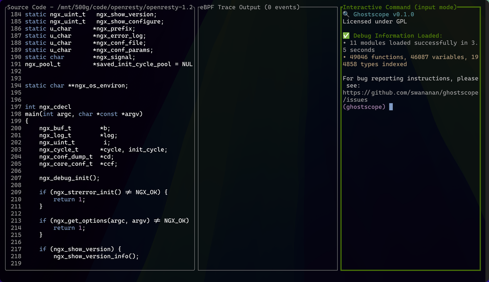

# GhostScope Tutorial

Learn to trace running applications with GhostScope in 10 minutes!

## Quick Start

### Launch GhostScope

GhostScope offers two modes for attaching to processes, both using Linux uprobe + eBPF mechanism:

#### Mode 1: PID-specific tracing (`-p`)
```bash
# Trace a specific running process by PID
sudo ghostscope -p $(pidof your_app)
```
- **When to use**: You have a running process and want to trace only that specific instance
- **Advantage**: Focused tracing with less noise from other processes
- **Limitation**: Can't catch early startup events

#### Mode 2: Binary-wide tracing (`-t`)
```bash
# Trace ALL processes using this binary
sudo ghostscope -t /path/to/binary

# Also works with shared libraries
sudo ghostscope -t /usr/lib/libexample.so
```
- **When to use**: You want to catch process startup events or trace multiple instances
- **Advantage**: Can capture events from process initialization, perfect for debugging startup issues
- **Note**: Will trace ALL processes using this binary/library, which may generate more events

#### Important Notes

> ⚠️ **Things to know**:
> 1. The `-p` option traces the main program and all currently loaded dynamic libraries (libraries loaded later via dlopen are not yet supported)
> 2. The executables and libraries you want to trace **must contain debug information**, otherwise GhostScope will be helpless. How to check? See the [Debug Symbols section in the Installation Guide](install.md#3-debug-symbols-required)

> 💡 **Technical background**: I don't really want to say so much, but I have to 😂. Understanding uprobe mechanism is crucial for using GhostScope correctly. I recommend reading the [Uprobe Internals](uprobe-internals.md) documentation to avoid common pitfalls.

## Understanding the TUI

### Starting Up and Loading

After successfully launching GhostScope, you'll see a loading screen — GhostScope is loading debug information and building query indices. This might take some time (loading nginx takes about 3 seconds, for example). Don't ask me why GDB loads so fast, I'm still learning optimization tricks from GDB, hoping to make it faster in future versions.


*GhostScope's carefully designed loading interface*

If all goes well, in the blink of an eye (you might miss the carefully designed loading screen), you'll see GhostScope's TUI interface:


*GhostScope TUI main interface*

### The Three Panels

Here's a brief introduction to GhostScope's TUI panel layout:

#### 1. Source Panel (Top)
- **What it shows**: Application source code (defaults to the file containing the main function)
- **Purpose**: Browse code and set trace points

#### 2. eBPF Output Panel (Middle)
- **What it shows**: Real-time trace output
- **Purpose**: View execution traces as they happen

#### 3. Command Panel (Bottom)
- **What it shows**: Command input line
- **Purpose**: Enter trace commands and control session

## Core Operations

Here are the two main ways to use GhostScope, as demonstrated in the README.

### Command Panel's Three Modes

Focus defaults to the **Command Panel**, which has three modes:

#### 1. Input Mode (Default)
In input mode, you can execute various commands. For example:
```
trace {target}  # target can be a function or source line number
```
For detailed command syntax, see [Command Reference](input-commands.md).

#### 2. Script Mode
Press Enter to enter script mode and start writing GhostScope scripts to probe processes:

- Use `print` to output local variables, parameters, and even global variables
- As long as DWARF info contains variable descriptions, you can get meaningful data
- Support for script variables and simple conditional logic
- For more script syntax details, see [Script Language Reference](scripting.md)


*Script editing mode*

After writing, press `Ctrl+S` to submit code. If all goes well, the script will be compiled to eBPF bytecode and loaded onto the uprobe.


*Script execution result*

#### 3. Command Mode
At this point, if everything works, we'll see the script output in the eBPF output panel. But to view it, we need to switch focus to the eBPF output panel.

Press `Esc` to switch from input mode to command mode. In this mode:

- **Vim-style navigation**: Use `hjkl` to browse history (inspired by cgdb)
- **Return to input mode**: Press `i`
- **Panel switching**:
  - `Tab` / `Shift+Tab`: Switch between panels
  - `Ctrl+W` + `hjkl`: Vim-style panel jumping (a blessing for Vim lovers 😁)

### Panel Operation Tips

#### eBPF Output Panel
When focused on the eBPF output panel, it also supports Vim-style navigation and quick movement.

#### Fullscreen Mode
If panels are too small, besides setting ratios at startup, you can:
- Press `Ctrl+W z`: Fullscreen the current focused panel (learned from tmux, also my favorite 😉)

For more panel operations, see [TUI Reference Guide](tui-reference.md) and [Command Reference](input-commands.md).

### 💡 Recommended Workflow

A more efficient approach is to start from the source panel:

1. **Browse source**: Switch focus to the source panel, use Vim-style navigation to browse code
2. **Quick trace point setting**: When you see an interesting line, press **Space** to directly enter script mode
   - The trace target automatically sets to the file and line number at the cursor
   - This design is inspired by cgdb, I really love this shortcut
3. **Switch files**: Press `o` to bring up the file search bar, quickly find and switch to other source files

This workflow is more fluid, making trace point setting effortless.

## Using Script Files

For repeated use, save your traces in a file:

```ghostscope
# trace.gs
trace calculate_something {
    print "FUNC: a={} b={}", a, b;
}

trace sample_program.c:16 {
    print "LINE16: result={}", result;
}
```

Run it:
```bash
sudo ghostscope -p $(pidof your_app) --script-file trace.gs
```


## Next Steps

- **Limitations** (Recommended): Read [Limitations](limitations.md) to understand known constraints and best practices
- **Full TUI Reference**: See [TUI Reference Guide](tui-reference.md) for all keyboard shortcuts
- **Command Reference**: See [Command Reference](input-commands.md) for all available commands
- **Script Language**: Learn the full syntax in [Script Language Reference](scripting.md)
- **Configuration**: See [Configuration Reference](configuration.md) for customization options

## Getting Help

- Press `?` in TUI for quick help
- Use `help <command>` in command panel
- Visit [GitHub Discussions](https://github.com/swananan/ghostscope/discussions)