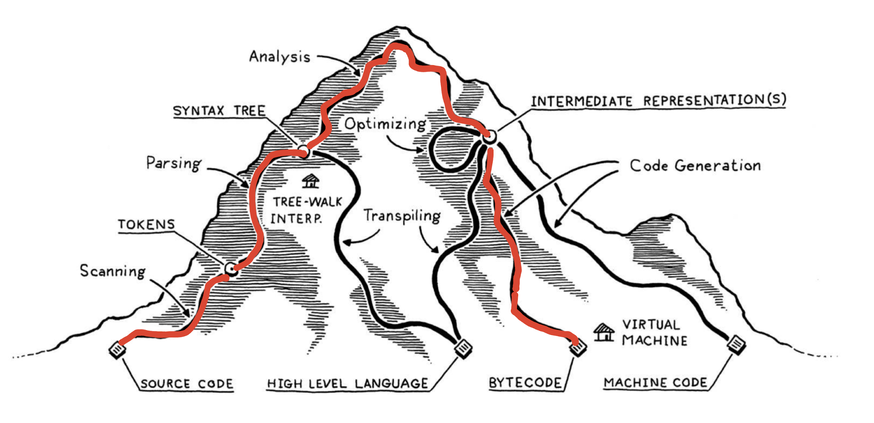

# GhostScope 架构

深入探讨基于 eBPF 的运行时追踪系统 GhostScope 的设计与实现。

## 系统概览

```
┌──────────────────────────────────────────────────────────┐
│                    终端 UI (TUI)                         │
│         ┌──────────────────────────────────┐             │
│         │      TEA 架构                    │             │
│         │   (Model-Update-View 模式)       │             │
│         └────────────┬─────────────────────┘             │
│                      │ 动作事件                          │
└──────────────────────┼───────────────────────────────────┘
                       │
            ┌──────────▼──────────┐
            │  事件注册器          │  基于通道的通信
            │  (mpsc channels)    │
            └──────────┬──────────┘
                       │
┌──────────────────────▼────────────────────────────────────┐
│              运行时协调器                                 │
│         (基于 Tokio 的异步编排)                           │
│                                                           │
│  ┌─────────────┐  ┌────────────┐  ┌─────────────┐         │
│  │ GhostSession│  │   DWARF    │  │    Trace    │         │
│  │  (状态)     │  │  Analyzer  │  │   Manager   │         │
│  └─────────────┘  └────────────┘  └─────────────┘         │
│                                                           │
│  事件循环：tokio::select! {                               │
│    - 等待 eBPF 事件 (来自所有 loaders)                    │
│    - 处理运行时命令 (来自 TUI)                            │
│    - 发送状态更新                                         │
│  }                                                        │
└───────────┬────────────────────────────┬──────────────────┘
            │                            │
   ┌────────▼─────────┐        ┌────────▼──────────┐
   │ 脚本编译器        │        │  eBPF Loaders     │
   │  (多阶段)        │        │ (每个trace的池)   │
   └──────────────────┘        └───────────────────┘
            │                            │
            └────────────┬───────────────┘
                         │
                  ┌──────▼──────┐
                  │   目标      │
                  │   进程      │
                  │  (uprobes)  │
                  └─────────────┘
```

## 工作空间结构

GhostScope 使用 Cargo workspace 进行模块化设计：

| Crate | 用途 |
|-------|------|
| **ghostscope** | 主程序和运行时协调器 - 通过异步事件循环协调所有组件 |
| **ghostscope-compiler** | 脚本编译流水线 - 通过 LLVM 将用户脚本转换为经过验证的 eBPF 字节码 |
| **ghostscope-dwarf** | 调试信息分析器 - 提供跨模块符号解析和类型信息 |
| **ghostscope-loader** | eBPF 程序生命周期管理器 - 通过 Aya 处理 uprobe 附加和 ring buffer 管理 |
| **ghostscope-ui** | 终端用户界面 - 实现基于 TEA (The Elm Architecture) 模式的交互式 TUI |
| **ghostscope-protocol** | 通信协议 - 定义 eBPF 与用户态数据交换的消息格式 |
| **ghostscope-platform** | 平台抽象层 - 封装架构特定代码（调用约定、ABI） |

## 核心架构组件

### 1. 运行时协调器

**角色**：异步编排器，复用 eBPF 事件和 UI 命令。

**关键职责**：
- 轮询 eBPF ring buffers 获取追踪事件（非阻塞）
- 接收来自 UI 的命令（脚本执行、trace 启用/禁用）
- 转发事件到 UI 进行显示
- 管理 trace 生命周期

### 2. GhostSession

**角色**：整个追踪会话的中央状态容器。

**管理内容**：
- DWARF 分析器（所有加载模块的调试信息）
- Trace 管理器（活动 traces 池）
- 目标进程信息（PID、二进制路径）
- 配置状态

**关键特性**：渐进式加载，带有 UI 进度更新回调。

### 3. DWARF 分析器

**角色**：高性能多模块调试信息系统。

**核心优化**：

1. **并行模块加载**
   - 异步并行加载所有进程模块（主程序 + 动态库）
   - 支持进度回调，为 UI 提供实时初始化反馈
   - 通过解析 `/proc/PID/maps` 高效发现模块

2. **跨模块符号解析**
   - 跨所有已加载模块的统一命名空间
   - 函数查找覆盖主程序和共享库
   - 支持内联函数的源码行号到地址映射
   - 跨模块边界的类型解析

3. **内存高效缓存**
   - 多级缓存存储频繁访问的符号
   - 延迟解析调试信息（按需解析）
   - 最小化具有大量调试信息的大型二进制文件的内存占用

4. **地址转换**
   - 自动处理 ASLR/PIE 地址
   - 虚拟地址到文件偏移的转换
   - 针对特定进程追踪的运行时地址映射

TODO: 但是依然很慢，需要继续研究 GDB 是怎么提升解析 DWARF 性能的。

### 4. 编译流水线

具有类型安全的多阶段流水线：

```
┌──────────────────────────────────────────────────────────┐
│ 阶段 1：脚本解析                                         │
│                                                          │
│   用户脚本 (*.gs)                                        │
│         ↓                                                │
│   Pest 解析器 (PEG 语法)                                 │
│         ↓                                                │
│   抽象语法树 (AST)                                       │
└──────────────────────────────────────────────────────────┘
                         ↓
┌──────────────────────────────────────────────────────────┐
│ 阶段 2：LLVM IR 生成                                     │
│                                                          │
│   AST + DWARF 信息                                       │
│         ↓                                                │
│   符号解析（变量、类型、位置）                           │
│         ↓                                                │
│   LLVM IR（类型安全的中间表示）                          │
└──────────────────────────────────────────────────────────┘
                         ↓
┌──────────────────────────────────────────────────────────┐
│ 阶段 3：eBPF 后端                                        │
│                                                          │
│   LLVM IR                                                │
│         ↓                                                │
│   LLVM BPF 后端（优化 + 代码生成）                       │
│         ↓                                                │
│   eBPF 字节码（验证器友好）                              │
└──────────────────────────────────────────────────────────┘
```

下图来自 [Crafting Interpreters](https://craftinginterpreters.com/)，红色路径标注了 GhostScope 的编译流程。当然，Pest 和 LLVM 已经为我们完成了绝大部分繁重的工作。


*编译流水线示意图（红色路径为 GhostScope 流程）*

### 5. Trace 管理器

**角色**：管理多个独立追踪点的生命周期。

**架构**：
- 每个 trace 有自己的 eBPF 程序和 ring buffer
- Traces 可以独立启用/禁用
- 资源隔离：一个 trace 的失败不影响其他
- 并发执行：所有 uprobes 在内核空间并行运行

### 6. UI 架构（TEA 模式）

**模式**：The Elm Architecture（Model-Update-View）

```
┌──────────────┐
│    Model     │  AppState (不可变的 UI 状态快照)
└──────┬───────┘
       │
┌──────▼───────┐
│   Update     │  事件处理器 (按键 → 动作 → 状态变更)
└──────┬───────┘
       │
┌──────▼───────┐
│    View      │  渲染 (状态 → 终端输出)
└──────────────┘
```

**优势**：
- 可测试：状态更新的纯函数
- 可预测：相同输入总是产生相同输出
- 可调试：可以重放事件序列
- 可维护：清晰的数据流

**通信方式**：通过通道与运行时通信（发送命令，接收追踪事件）。

### 7. eBPF 到用户态通信

**核心机制**：Ring buffer（内核内存中的每 CPU 循环缓冲区）。

#### Ring Buffer 架构

```
┌───────────────────────────────────────────────────────┐
│              内核空间                                 │
│                                                       │
│  ┌────────────┐                                       │
│  │  eBPF      │  追踪事件发生                         │
│  │  程序      │         ↓                             │
│  │  (uprobe)  │  收集数据（寄存器、内存）             │
│  └─────┬──────┘         ↓                             │
│        │         序列化为协议格式                     │
│        │                ↓                             │
│        │         bpf_ringbuf_output()                 │
│        │                ↓                             │
│        └────────►┌─────────────────────┐              │
│                  │  Ring Buffer        │              │
│                  │  (每CPU，256KB)     │              │
│                  │                     │              │
│                  │  [事件1][事件2]...  │              │
│                  └──────────┬──────────┘              │
└─────────────────────────────┼─────────────────────────┘
                              │ 内存映射
                              ↓
┌─────────────────────────────┼─────────────────────────┐
│              用户空间       │                         │
│                             │                         │
│  ┌──────────────────────────▼──────────┐              │
│  │  Trace Manager                       │             │
│  │  (轮询 ring buffer)                  │             │
│  └──────────────────────┬───────────────┘             │
│                         │                             │
│              读取事件（非阻塞）                       │
│                         ↓                             │
│  ┌──────────────────────────────────────┐             │
│  │  流式解析器                           │            │
│  │  (处理可变长度消息)                   │            │
│  └──────────────────────┬───────────────┘             │
│                         │                             │
│              解析后的追踪事件                         │
│                         ↓                             │
│  ┌──────────────────────────────────────┐             │
│  │  运行时协调器                         │            │
│  │  (转发到 UI)                          │            │
│  └──────────────────────────────────────┘             │
└───────────────────────────────────────────────────────┘
```

#### 通信流程

1. **事件生成**（内核）：
   - 目标指令执行时 Uprobe 触发
   - eBPF 程序收集数据（通过 DWARF 位置读取寄存器、栈、内存）
   - 根据协议格式序列化数据
   - 调用 `bpf_ringbuf_output()` 写入 ring buffer

2. **事件轮询**（用户空间）：
   - Trace 管理器轮询 ring buffer（通过 Aya 框架）
   - 非阻塞：如果没有事件立即返回
   - 内存映射：零拷贝访问内核缓冲区

3. **事件解析**：
   - 流式解析器处理可变长度消息
   - 状态机跟踪跨 chunk 的部分读取
   - 重建完整事件

4. **事件投递**：
   - 解析后的事件发送到运行时协调器
   - 协调器通过通道转发到 UI
   - UI 实时更新显示

#### 协议格式

GhostScope 使用**基于指令的协议**实现灵活的追踪事件表示：

```
┌─────────────────────────────────────────────────────┐
│ TraceEventHeader (4 字节)                           │
│   - magic: u32 (0x43484C53 "CHLS")                  │
├─────────────────────────────────────────────────────┤
│ TraceEventMessage (24 字节)                         │
│   - trace_id: u64                                   │
│   - timestamp: u64                                  │
│   - pid: u32                                        │
│   - tid: u32                                        │
├─────────────────────────────────────────────────────┤
│ 指令序列 (可变长度)                                 │
│                                                     │
│   ┌──────────────────────────────────────┐          │
│   │ InstructionHeader (4 字节)           │          │
│   │   - inst_type: u8                    │          │
│   │   - data_length: u16                 │          │
│   │   - reserved: u8                     │          │
│   ├──────────────────────────────────────┤          │
│   │ InstructionData (可变长度)           │          │
│   │   - 根据指令类型而不同               │          │
│   └──────────────────────────────────────┘          │
│                                                     │
│   ... (更多指令) ...                                │
│                                                     │
│   ┌──────────────────────────────────────┐          │
│   │ EndInstruction (结束标记)            │          │
│   │   - total_instructions: u16          │          │
│   │   - execution_status: u8             │          │
│   └──────────────────────────────────────┘          │
└─────────────────────────────────────────────────────┘
```

**指令类型**：

| 类型 | 代码 | 用途 |
|------|------|------|
| **PrintStringIndex** | 0x01 | 打印静态字符串（索引化） |
| **PrintVariableIndex** | 0x02 | 打印带类型信息的简单变量 |
| **PrintComplexVariable** | 0x03 | 打印带访问路径的结构体/数组 |
| **PrintComplexFormat** | 0x05 | 带复杂变量的格式化打印 |
| **Backtrace** | 0x10 | 带栈帧地址的栈回溯 |
| **EndInstruction** | 0xFF | 标记指令序列结束 |

**变量状态跟踪**：

每个变量指令都包含一个 `status` 字段 (u8) 指示数据获取结果：

| 状态 | 值 | 含义 |
|------|-----|------|
| **Ok** | 0 | 变量读取成功 |
| **NullDeref** | 1 | 尝试解引用空指针 |
| **ReadError** | 2 | 内存读取失败（无效地址） |
| **AccessError** | 3 | 内存访问被拒绝（权限问题） |
| **Truncated** | 4 | 数据被截断（超出大小限制） |

这种按变量的错误报告机制允许：
- **部分成功**：即使部分变量失败，也能打印成功读取的变量
- **精确诊断**：在复杂表达式中准确定位失败点
- **安全运行**：尽管单个读取失败，eBPF 程序仍继续执行
