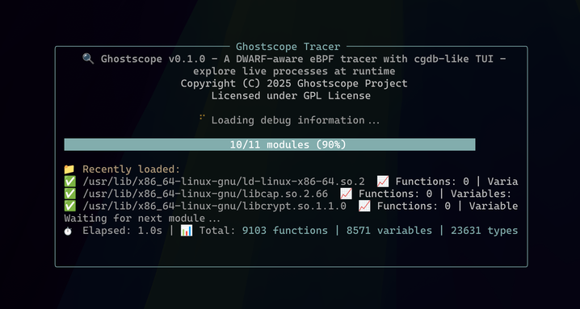
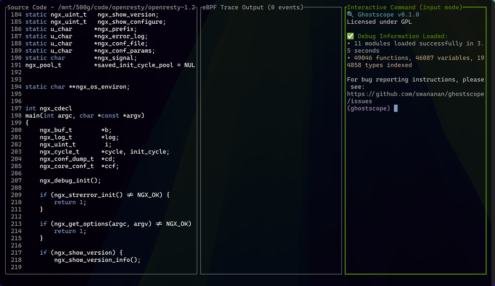
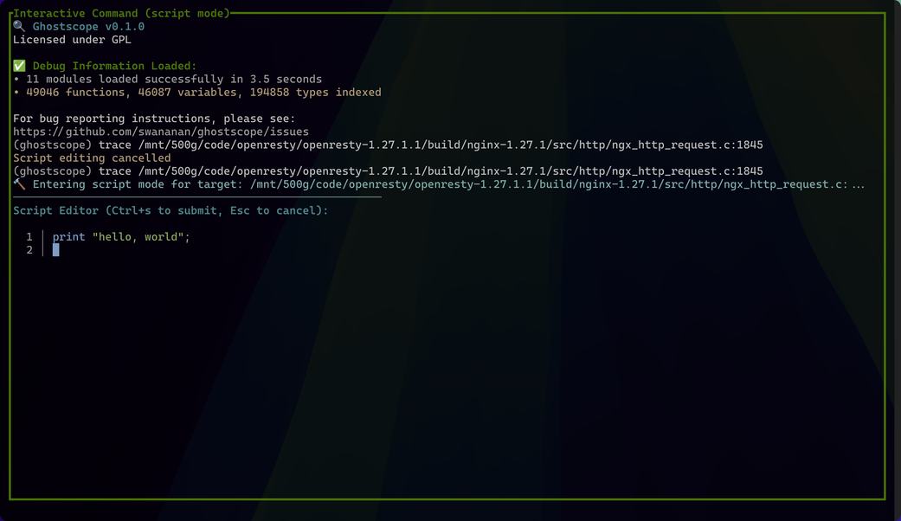
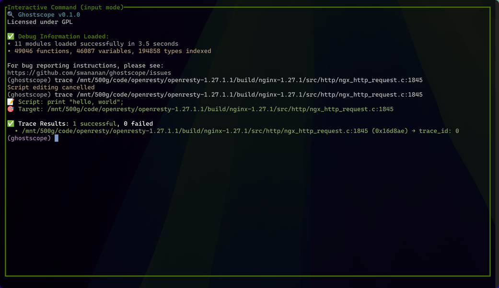
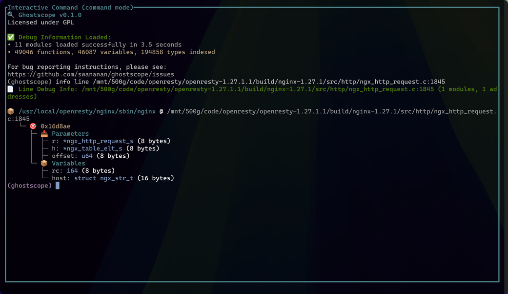
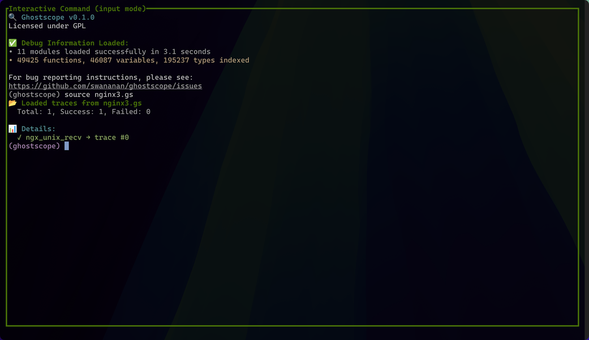

# GhostScope 教程

10 分钟学会使用 GhostScope 追踪运行中的应用程序！

## 快速开始

### 启动 GhostScope

GhostScope 提供两种模式来附加到进程，两者都使用 Linux uprobe + eBPF 机制：

#### 模式 1：特定 PID 追踪（`-p`）
```bash
# 通过 PID 追踪特定的运行进程
sudo ghostscope -p $(pidof your_app)
```
- **使用场景**：您有一个运行中的进程，只想追踪该特定实例
- **优势**：专注追踪，减少来自其他进程的噪音
- **限制**：无法捕获早期启动事件

#### 模式 2：全二进制追踪（`-t`）
```bash
# 追踪所有使用此二进制文件的进程
sudo ghostscope -t /path/to/binary

# 也适用于共享库
sudo ghostscope -t /usr/lib/libexample.so
```
- **使用场景**：您想捕获进程启动事件或追踪多个实例
- **优势**：可以捕获进程初始化的事件，非常适合调试启动问题
- **注意**：将追踪所有使用此二进制文件/库的进程，可能会产生更多事件

#### 重要说明

> ⚠️ **注意事项**：
> 1. `-p` 选项会追踪该进程对应的主程序以及目前已经加载的所有动态库（后续通过 dlopen 加载的动态库暂不支持）
> 2. 您想追踪的可执行文件和动态库**必须包含调试信息**，否则 GhostScope 将无计可施。如何判断调试符号是否存在？请参考[安装指南的调试符号章节](install.md#3-调试符号必需)


## 了解 TUI 界面

### 启动和加载

成功执行启动命令后，您会看到一个加载界面 — GhostScope 正在加载调试信息并建立查询索引。这可能需要一些时间（比如加载 nginx 大约需要 3 秒）。别问我为什么 GDB 加载那么快，我还在努力向 GDB 学习优化技巧，争取后面版本能更快一些。


*GhostScope 精心设计的加载界面*

如果一切顺利，只需一眨眼的时间（可能会因此错过精心设计的加载界面），我们就会看到 GhostScope 的 TUI 界面：


*GhostScope TUI 主界面*

### 三大面板
简单介绍一下 GhostScope 的 TUI 面板构成：

#### 1. 源代码面板
- **显示内容**：应用程序的源代码（默认展示 main 函数所在的代码文件）
- **用途**：浏览代码并设置追踪点

#### 2. eBPF 输出面板
- **显示内容**：实时追踪输出
- **用途**：查看实时发生的执行追踪

#### 3. 命令交互面板
- **显示内容**：命令输入行
- **用途**：输入追踪命令和控制会话

## 核心操作

这里展示两种最主要的使用方式，也就是 README 中 demo 所演示的内容。

### 命令交互面板的三种模式

焦点默认在**命令交互面板**，该面板有三个模式：

#### 1. 输入模式（默认）
在输入模式下，您可以执行各种命令。例如：
```
trace {target}  # target 可以是函数或源码行号
```
详细命令语法请参考[命令参考](input-commands.md)。

#### 2. 脚本模式
按回车后进入脚本模式，开始编写 GhostScope 脚本来探测进程：

- 使用 `print` 打印局部变量、参数甚至全局变量
- 只要 DWARF 信息包含变量描述，就能获取有意义的数据
- 支持定义脚本变量和简单的判断逻辑
- 更多脚本语法细节请参考[脚本语言参考](scripting.md)


*脚本编辑模式*

编写完成后，按 `Ctrl+S` 提交代码。如果一切顺利，脚本会被编译成 eBPF 字节码并加载到 uprobe 上。


*脚本执行结果*

#### 3. 命令模式
这个时候，如果一切顺利，我们将在 eBPF 输出面板上看到脚本对应的输出。但要查看输出，我们需要把焦点切换到 eBPF 输出面板。


*eBPF 输出结果*

按 `Esc` 从输入模式切换到命令模式，在这个模式下：

- **Vim 风格导航**：使用 `hjkl` 浏览历史消息（灵感来自 cgdb）
- **回到输入模式**：按 `i` 键
- **面板切换**：
  - `Tab` / `Shift+Tab`：在面板间切换
  - `Ctrl+W` + `hjkl`：Vim 风格的面板跳转（Vim 爱好者的福音 😁）

### 面板操作技巧

#### eBPF 输出面板
当焦点在 eBPF 输出面板时，同样支持 Vim 风格的导航和快速移动。

#### 全屏模式
如果面板太小，除了启动时设置比例，还可以：
- 按 `Ctrl+W z`：将当前焦点面板全屏（这招从 tmux 学来的，也是我的最爱 😉）

更多面板操作请参考 [TUI 参考指南](tui-reference.md) 和 [命令参考](input-commands.md)。

### 💡 推荐的工作流程

更高效的使用方式是从源代码面板开始：

1. **浏览源码**：把焦点切换到源码面板，使用 Vim 风格导航浏览代码
2. **切换文件**：按 `o` 键唤出文件搜索栏，快速查找并切换到其他源码文件
3. **快速设置追踪点**：当看到感兴趣的代码行时，按**空格键**直接进入脚本模式
   - trace 的 target 会自动设置为光标所在的文件和行号
   - 这个设计灵感来自 cgdb，我非常喜欢这种快捷方式

这样的工作流程更加流畅，让追踪点的设置变得轻而易举。

### 💡 查看追踪点可用变量

在设置追踪点之前，如果想知道某个位置可以访问哪些局部变量和参数，可以使用 `info` 命令：

```
info line <file:line>       # 查看源码行的可用变量
info function <func_name>   # 查看函数入口的可用变量
info address <0xADDR>       # 查看地址的可用变量
```

这些命令会显示该位置的调试信息，包括可访问的变量列表：


*使用 info line 命令查看可用变量*


### 使用脚本文件

为了重复使用，我们可以将追踪脚本保存在文件中：

```ghostscope
# trace.gs
trace calculate_something {
    print "FUNC: a={} b={}", a, b;
}

trace sample_program.c:16 {
    print "LINE16: result={}", result;
}
```

我们既可以通过命令行直接运行它：
```bash
sudo ghostscope -p $(pidof your_app) --script-file trace.gs
```

我们也可以在 TUI 的命令交互面板上，通过 `source <脚本名称>` 的方式直接加载脚本：


*使用 source file 命令直接加载脚本*

**💡 小贴士**：在 TUI 中设置了多个追踪点后，可以使用 `save trace <文件名>` 命令将所有当前追踪点保存到文件中，方便后续复用。详见[命令参考](input-commands.md)。


## 下一步

- **使用限制**（推荐阅读）：阅读 [使用限制](limitations.md) 了解已知约束和最佳实践
- **技术背景**：其实我也不想说那么多，但不说不行 😂，理解 uprobe 机制对正确使用 GhostScope 至关重要，推荐阅读 [Uprobe 内部机制](uprobe-internals.md) 文档，避免踩坑。
- **TUI 完整参考**：[TUI 参考指南](tui-reference.md) - 所有键盘快捷键
- **命令参考**：[命令参考](input-commands.md) - 所有可用命令
- **脚本语言**：[脚本语言参考](scripting.md) - 完整的语法说明
- **配置选项**：[配置参考](configuration.md) - 自定义配置选项
